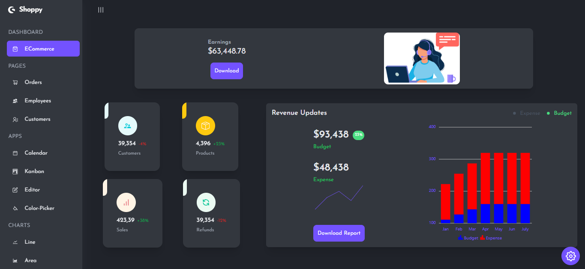
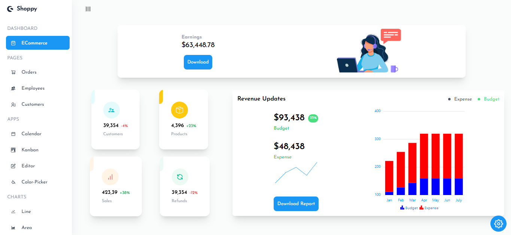

# 📊 React Admin Dashboard

A modern admin dashboard built with React featuring beautiful charts, dark/light themes, and dummy data management. Perfect for eCommerce analytics and user management!




[](https://admin-dashboard-2193.netlify.app/)
[](https://github.com/AnasHany2193/react-admin-dashboard)
[](https://www.linkedin.com/in/anashany219/)

## 🚀 Features

- 🌓 **Dark/Light Mode** - Toggle between beautiful dark and light themes
- 📈 **Interactive Charts** - Multiple chart types for data visualization
- 📱 **Responsive Design** - Works perfectly on all screen sizes
- 🛒 **eCommerce Section** - Product statistics and sales analytics
- 👥 **Employee Management** - Team member profiles and details
- 📅 **Calendar Integration** - Event scheduling and management
- 🧩 **Modular Components** - Reusable and well-organized UI components
- ⚡ **Fast Performance** - Optimized for smooth user experience

## 📊 Charts & Components

- 🎯 **Line Charts** - Sales trends and revenue analysis
- 📊 **Bar Charts** - Product comparisons and performance metrics
- 🧩 **Pie Charts** - Market share and category distribution
- 📈 **Stacked Charts** - Multi-layered data visualization
- 📝 **Data Grids** - Tabular data presentation with sorting/filtering
- 🔧 **Custom Tooltips** - Interactive chart information displays

## 🛠️ Technologies Used

- ⚛️ **React** - Frontend framework
- 🎨 **Tailwind CSS** - Styling and responsive design
- 📊 **Syncfusion** - Charting and UI components
- 🔄 **React Router** - Navigation and routing
- 🎭 **Context API** - State management for theme switching
- 📦 **npm** - Package management

## 🖥️ Installation

1. Clone the repository:

   ```bash
   git clone https://github.com/AnasHany2193/react-admin-dashboard.git
   ```

2. Install dependencies:
   ```bash
   npm install
   ```
3. Start the development server:
   ```bash
   npm start
   ```

## 📚 API & Data

- 📂 **Dummy Data** - Local JSON files for mock data
- 🔄 **Syncfusion Components** - Licensed UI components library
- 🖼️ **Heroicons** - Beautiful SVG icons for actions and menus

## 🤝 Contribution

Contributions are welcome! Please open an issue or PR for any improvements.

---

⭐ Star this repo if you found it useful!
👨💻 Connect with me on [LinkedIn](https://www.linkedin.com/in/anashany219/) for more projects and updates!
